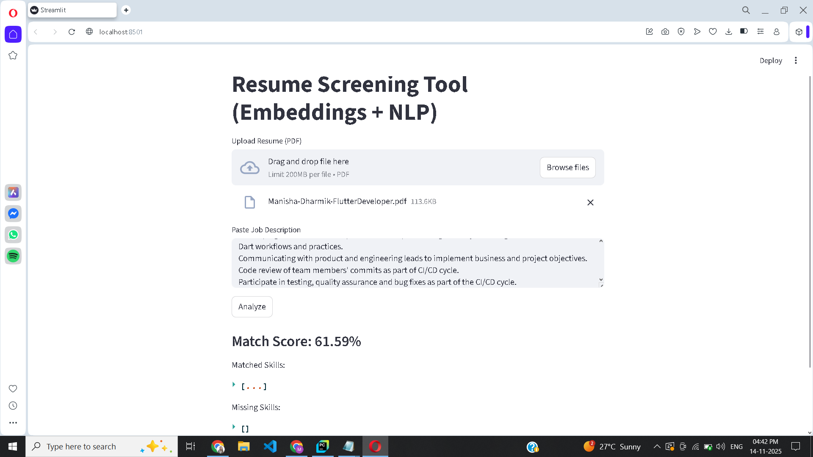

# 🧠 AI Resume Screening Tool

A smart NLP-based application that compares a candidate’s resume with a job description using **Sentence-BERT embeddings + cosine similarity**.  
It understands **semantic meaning**, not just keywords — giving more accurate and fair resume match scores.

🔗 **Live App:** https://resume-screening-nlp-ceykkwbhn69n94dgqt5tt8.streamlit.app/  
📦 **Repository:** https://github.com/manishadharmik7/resume-screening-nlp

---

## 🚀 Features
- 📄 Upload PDF resume  
- 📝 Paste job description  
- 🔍 Skill extraction (spaCy)  
- 🔢 SBERT embeddings for semantic matching  
- 📊 Cosine similarity score  
- 🎯 Clean Streamlit UI  

---

## 🛠 Tech Stack
- **NLP Model:** Sentence-BERT (all-MiniLM-L6-v2)  
- **Framework:** Streamlit  
- **PDF Parsing:** pdfplumber  
- **NER:** spaCy  
- **Similarity:** Cosine similarity  

---

## 📁 Project Structure
resume-screening/
│
├── app.py # Streamlit UI
├── model.py # Embeddings, similarity, skill extraction
├── utils.py # PDF reading helpers
├── requirements.txt
└── README.md


---

## 🔧 Installation
```bash
git clone https://github.com/manishadharmik7/resume-screening-nlp.git
cd resume-screening-nlp

python -m venv .venv
.\.venv\Scripts\activate   # Windows

pip install -r requirements.txt
streamlit run app.py

```

---
📸 Screenshots
